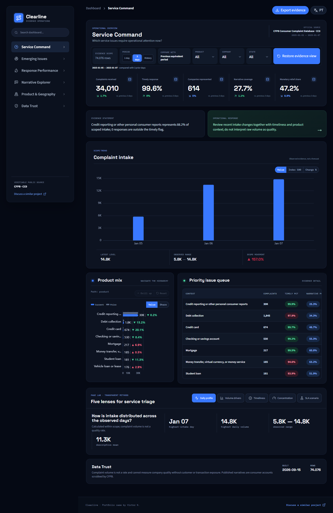

# Clearline Service Intelligence

A financial-service operations case that turns official CFPB complaint data into issue detection, response monitoring, and explainable narrative triage.

**[Open the live demo](https://clearline-service-intelligence.pages.dev/)** · [Leia em português](README.pt-BR.md)

## Documentation

- [Analysis readout](docs/ANALYSIS_READOUT.md)
- [Data audit](docs/DATA_AUDIT.md)
- [Dashboard guide](docs/DASHBOARD_GUIDE.md)
- [Quality review](docs/DASHBOARD_QUALITY_REVIEW.md)



## Business problem

Complaint dashboards often rank companies by raw volume, creating a false quality score. Clearline keeps names available for investigation but compares only defensible operational measures within product, period, and minimum-sample context.

## Data

- Official [CFPB Consumer Complaint Database](https://www.consumerfinance.gov/data-research/consumer-complaints/), CC0.
- Demo extract: 74,076 complaint records received from 1 to 7 Jan 2025.
- Published narratives are consumer accounts released after CFPB privacy processing.
- Complaint volume is not statistically representative and has no customer or transaction denominator.

## Decision experience

`Service Command` → `Emerging Issues` → `Response Performance` → `Narrative Explorer` → `Product & Geography` → `Data Trust`

The application supports issue triage, timely-response monitoring, product context, and explainable text groups. It does not label a company best or worst.

### Evidence Lab

Every page uses five complementary lenses instead of repeating the KPI cards. The command page covers:

- **Daily profile** shows the highest observed day, range, and descriptive mean without claiming statistical control from seven days.
- **Drivers** attributes absolute volume changes versus the previous window to products.
- **Timeliness** translates a high response rate into the remaining estimated exception volume.
- **Concentration** reports Top 3 share and HHI without pretending complaint volume is a quality rate.
- **Scenario** estimates the operational effect of reducing untimely responses; it is not a forecast or causal claim.

The secondary labs are purpose-built for issue momentum and triage, response exceptions and SLA sensitivity, narrative coverage and review gaps, like-for-like product/geography/company context, and evidence completeness, boundaries, reconciliation, and readiness.

## Architecture

`CFPB filtered CSV API → Python/DuckDB → dbt marts → explainable topic rules → Parquet/JSON → React + ECharts`

## Run locally

```powershell
python -m venv .venv
.venv\Scripts\pip install -r requirements.txt
npm install
python -m pipeline download --date-min 2025-01-01 --date-max 2025-01-07
python -m pipeline build
python -m pipeline topics-audit
npm run dev
```

Validate with `python -m pipeline validate`, `pytest`, `npm test`, `npm run build`, and `npm run test:e2e`.

## Portfolio evidence

- Official source provenance and public-data caveats.
- Operational response metrics with minimum sample thresholds.
- Deterministic narrative grouping with published rules, coverage audit, and no causal claim.
- No misleading company-quality league table.
- Bilingual responsive experience and evidence-oriented design.

## Client adaptation

A production version would combine CRM tickets, contact-center events, account exposure, SLA policies, and quality-review outcomes. [Discuss a similar project](mailto:victorn198@outlook.com).

See [Portuguese documentation](README.pt-BR.md), [analytical readout](docs/ANALYSIS_READOUT.md), [data audit](docs/DATA_AUDIT.md), [dashboard quality review](docs/DASHBOARD_QUALITY_REVIEW.md), [complete dashboard guide](docs/DASHBOARD_GUIDE.md), [metric catalog](docs/METRIC_CATALOG.md), and [demo guide](docs/DEMO_GUIDE.md).
## Design innovation

The **Daily Intake Profile** combines discrete daily volume, product drivers, exception burden, concentration, and a bounded SLA scenario. It supports triage without presenting seven days of complaint volume as statistical control, causality, prevalence, or a company quality score.
