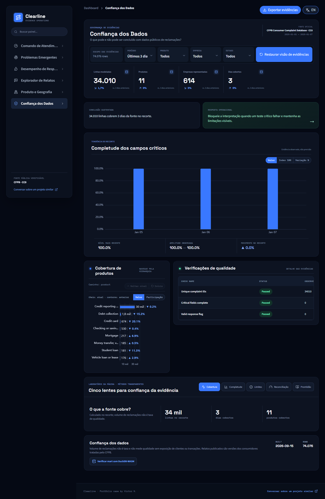

# Clearline Service Intelligence

**[Abrir demo ao vivo](https://clearline-service-intelligence.pages.dev/)** · [Read in English](README.md)

## Documentação

- [Guia completo do dashboard](docs/DASHBOARD_GUIDE.pt-BR.md)
- [Catálogo de métricas](docs/METRIC_CATALOG.md)
- [Roteiro de demonstração](docs/DEMO_GUIDE.md)
- [Leitura analítica em português](docs/ANALYSIS_READOUT.pt-BR.md)
- [Auditoria dos dados](docs/DATA_AUDIT.md)



Case de operações de atendimento financeiro que transforma dados oficiais do CFPB em detecção de problemas, acompanhamento de resposta e triagem textual explicável.

## Problema de negócio

Rankear empresas por volume bruto de reclamações cria uma falsa nota de qualidade. O Clearline permite investigação por empresa, mas compara apenas métricas operacionais defensáveis dentro de produto, período e amostra mínima.

## Dados e arquitetura

- Fonte: [Consumer Complaint Database](https://www.consumerfinance.gov/data-research/consumer-complaints/) do CFPB, CC0.
- Demo com 74.076 reclamações oficiais de 1 a 7 de janeiro de 2025.
- Pipeline: `CSV oficial → Python/DuckDB → dbt → tópicos explicáveis → Parquet/JSON → React/ECharts`.
- Volume não é taxa e a base não possui denominador de clientes ou transações.

## Laboratório de evidências

Todas as páginas usam cinco lentes complementares, sem repetir os números dos cards. A página de comando cobre:

- **Perfil diário** mostra maior dia observado, amplitude e média descritiva sem alegar controle estatístico com apenas sete dias.
- **Drivers** atribui mudanças absolutas contra a janela anterior aos produtos.
- **Prazo** traduz a taxa elevada no volume estimado de exceções remanescentes.
- **Concentração** calcula participação do Top 3 e HHI sem tratar volume como nota de qualidade.
- **Cenário** estima o efeito operacional de reduzir atrasos; não é previsão nem afirmação causal.

Os laboratórios secundários são próprios para momento e triagem de temas, exceções e sensibilidade de SLA, cobertura e lacunas de revisão textual, contexto comparável de produto/geografia/empresa e completude, limites, reconciliação e prontidão das evidências.

## Execução

```powershell
python -m venv .venv
.venv\Scripts\pip install -r requirements.txt
npm install
python -m pipeline download --date-min 2025-01-01 --date-max 2025-01-07
python -m pipeline build
npm run dev
```

O case demonstra governança de evidências, métricas de resposta, análise textual interpretável, interface bilíngue e limitações explícitas. [Contato](mailto:victorn198@outlook.com).
## Inovação de design

O **Gráfico de Controle de Sinais** separa variação esperada de dias acima de um limite estatístico de atenção. Ele apoia triagem sem apresentar volume de reclamações como causalidade, prevalência ou nota de qualidade da empresa.
